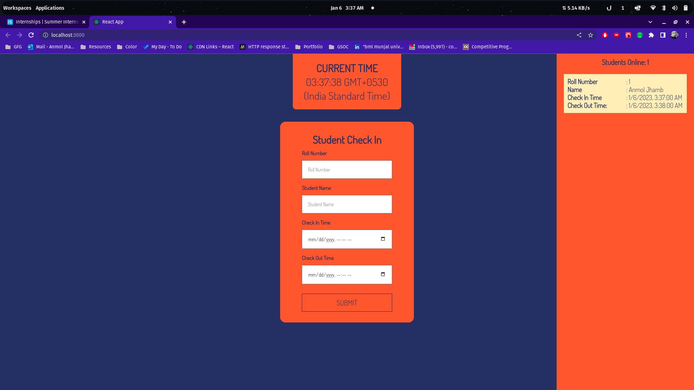
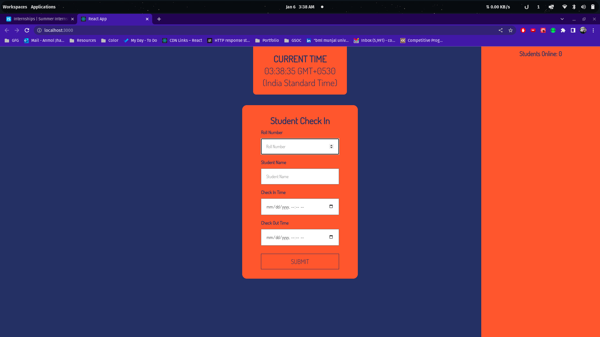

# Student Check In

A repo to complete a given assignemnt.

# Assignment

Student Attendance.
Create a student attendance system where you can enter the roll number of students and keep a record of students present in the school today. These data have to be created using the useState() and useEffect() functions. You are not allowed to use any external dependencies. You are free to create any type of interface, there are no restrictions. Make sure it has the following functionality -

1. Should be able to input Roll Number and Student Name.
1. Checkin Time and Checkout Time.
1. Should be able to check how many students are there in the school right now.

# Demo

A demo of the app can be found [here](https://student-checkin.vercel.app/)

# Screenshots




# Run the server

```bash
npm start
```
